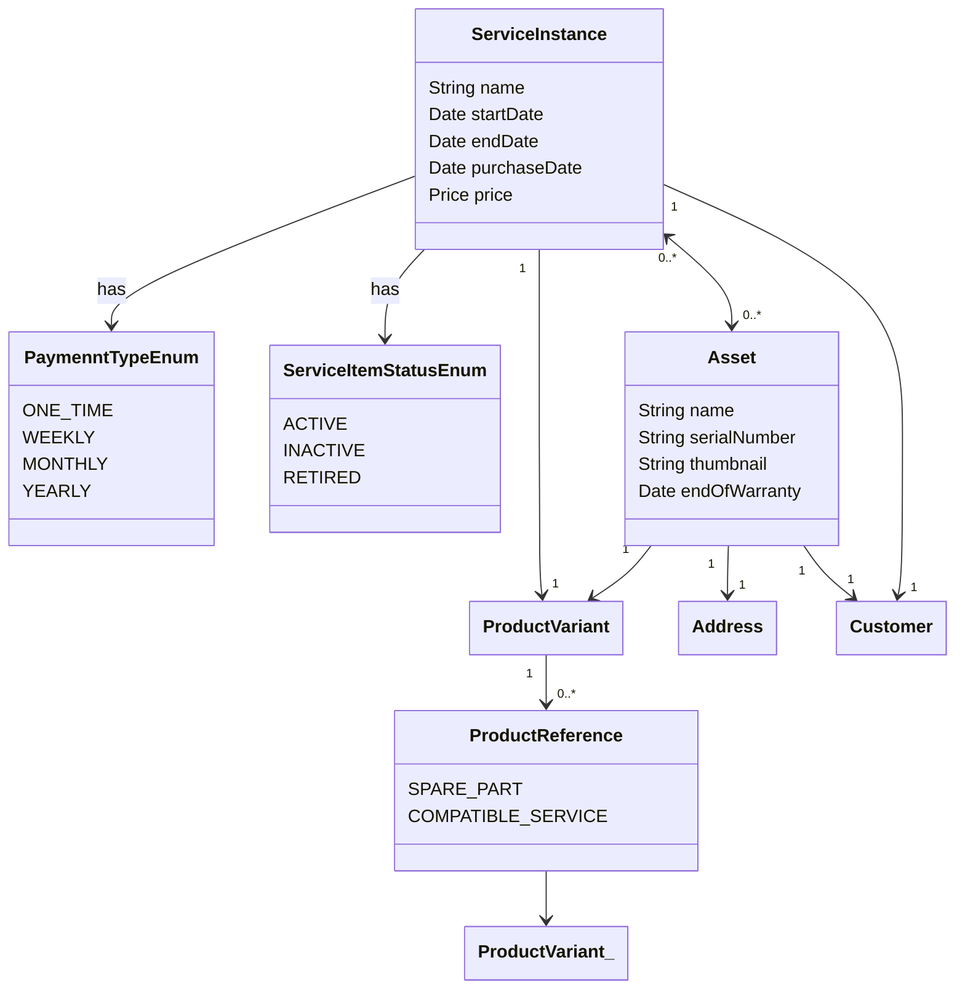

# Medusa Assets & Services Manager

A Medusa.js plugin for managing customer-linked product instances and service subscriptions.

## Overview

The `assets-services` plugin extends Medusa with the ability to manage **physical product instances (assets)** and **related service subscriptions (service instances)** linked to individual customers. It supports a wide range of after-sales and post-purchase use cases, such as:

- Assigning products (with serial numbers) to customers
- Attaching services to assets (e.g. maintenance plans, insurance, calibration)
- Selling standalone services (e.g. rentals, diagnostics)
- Managing product relationships (e.g. compatible services, spare parts)

The plugin enhances the Medusa admin interface with new panels for managing **assets**, **services**, and **product references**, enabling rich linking and management flows.

This plugin is used in [Open Self Service](https://github.com/o2sdev/openselfservice), a composable customer portal for viewing owned products, warranty info, and activating additional services.

You can find admin [API definition](openapi.yml) in repo files.

## Installation

1. **Install plugin package**
   <!-- code block:  -->
    ```bash
    yarn add @o2s/medusa-plugin-assets-services
    npm install
    yarn add @o2s/medusa-plugin-assets-services
    ```

2. **Register plugin in `medusa-config.js`**
   ```js
    ...
    plugins: [
        {
            resolve: "@o2s/medusa-plugin-assets-services",
            options: {}
        }
    ]
    ...
    ```

3. **Run DB migrations** - This plugin introduces new models in database so you need to execute db migration
   ```bash
    npx medusa db:migrate
    ```

## Features

### Asset Management
- Register purchased product instances per customer
- Track serial numbers, warranty dates, and installation addresses
- Link to product variants and optionally store thumbnails

### Service Instance Management
- Create/manage service subscriptions (linked to assets or standalone)
- Supports various billing models: one-time, weekly, monthly, yearly
- Statuses: Active / Inactive / Retired

### Product References
- Define references such as:
    - `SPARE_PART`
    - `COMPATIBLE_SERVICE`
- Easily attach compatible services or accessories

### Admin Interface Extensions
- Adds new admin menu entries:
    - Assets
    - Services
- Adds a new component on the product variant page to manage product references
- "Deep-linking" between assets, services, and products

## Compatibility

- Medusa version >= 2.4.0

## Known Issues

- Unlinking the **last asset** from a service instance currently fails.

## Used In: Open Self Service

Although this plugin is generic and can be used independently, it was developed to power one of core backend functionalities of [Open Self Service](https://github.com/o2sdev/openselfservice), a frontend portal that allows customers to:
- Browse and manage their purchased assets
- Check product status and warranty
- View and activate compatible service plans

Explore the Open Self Service project to see how this plugin supports real-world industrial self-service scenarios.

## Models schema

### Services & Assets

